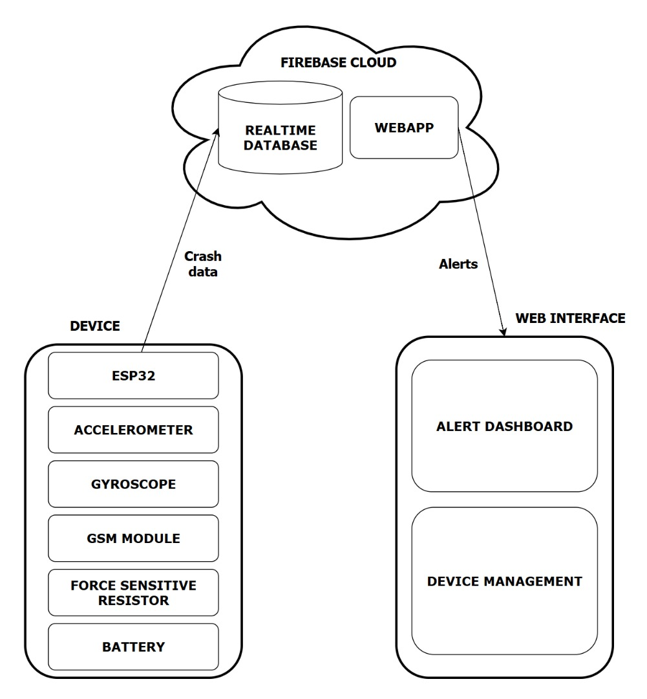

# Technical Report - The Smart Boda Device

**Group 7**  
- Watts Ryan Eric -- 24/U/20732/EVE -- 2400720732  
- Ssentaba Brian Kirabo -- 24/U/24769/PSA -- 2400724769  
- Akoragye Neville -- 24/U/03195/EVE -- 2400703195  
- Kazibwe David Nelson -- 24/U/24054/PS -- 2400724054  
- Mawanda John Paul -- 24/U/0678 -- 2400700678  

**Mentor:** Mr. Paddy Asiimwe  
**Course:** CSC 1304 Practical Skills Development  
**Date:** July 13, 2025  

## Abstract

> Uganda faces a high rate of road traffic accidents, with emergency response and reporting often delayed due to a lack of real-time detection and communication tools. The Smart Boda Device is a low-cost, sensor-based solution designed to detect likely accidents involving boda bodas in real time. By fusing data from accelerometers, gyroscopes, force sensors, and GPS, the device identifies crash events and transmits critical data to a Flutter-based web platform using Firebase and Firestore [5]. This enables emergency responders and authorities to monitor incidents, analyze accident hotspots, and inform infrastructure improvements. The system is scalable and accessible, with potential for integration into fleet management and urban safety planning.

## Table of Contents

- [Introduction](#introduction)
  - [User Challenge](#user-challenge)
  - [Project Goals](#project-goals)
  - [Functional Requirements](#functional-requirements)
- [Project Results](#project-results)
  - [Product Design](#product-design)
  - [Product Functionality](#product-functionality)
    - [Web Application Interface and Screenshots](#web-application-interface-and-screenshots)
    - [Our Basis for Accident Detection](#our-basis-for-accident-detection)
- [Limitations and Next Steps](#limitations-and-next-steps)
  - [Limitations](#limitations)
  - [Next Steps](#next-steps)
- [References](#references)
- [Appendix A: Project Work Plan](#appendix-a-project-work-plan)
- [Appendix B: Contribution by Team Members](#appendix-b-contribution-by-team-members)
- [Appendix C: Project Links](#appendix-c-project-links)

## Introduction

### User Challenge

Uganda's urban transport sector, particularly the boda boda industry, suffers from frequent accidents and delayed emergency responses. Current interventions lack real-time, automated detection and reporting, making it difficult for emergency services to respond promptly and for authorities to gather actionable data for policy and infrastructure improvements.

### Project Goals

- Develop a real-time accident detection system using sensor fusion (impact force, orientation, velocity, and acceleration) [3].
- Build a web-based platform for monitoring and alerting emergency responders using Flutter [4].
- Gather and analyze accident data to support future infrastructure and safety planning.
- Prototype a scalable, low-cost, and accessible hardware-software solution for widespread adoption.

### Functional Requirements

- **Accident Detection:** Identify crashes using data from accelerometer, gyroscope, force sensor, and GPS [3].
- **Data Transmission:** Send incident data to a web application in real time using GSM and cloud services.
- **Web Platform:** Visualize accident locations, historical data, and analytics for authorized users.
- **Data Storage:** Securely store all incident records using Firebase and Firestore [5].
- **Usability:** Ensure easy installation, low power consumption, and minimal rider interaction.

## Project Results

### Product Design

**Hardware Components:**

- MPU6050 Sensor: 3-axis accelerometer and gyroscope for motion and orientation sensing [3].
- NEO-6MV2 GPS Module: Provides real-time location and velocity data.
- Force Sensor (FSR402/Piezoelectric): Detects impact magnitude, reducing false positives.
- ESP32 Microcontroller: Manages sensor data acquisition and processing.
- SIM800L GSM Module: Enables data transmission via cellular network.
- LiPo Battery: Rechargeable power source with voltage regulation.

**Software Components:**

- Firmware: Implements sensor fusion, thresholding, and communication protocols.
- Web Application: Developed in Flutter, displays real-time alerts, mapping, and analytics [4].
- Backend: Firebase and Firestore for secure, scalable data storage and management [5].

**System Architecture:**

The Smart Boda system is composed of three core components: the physical device, the Firebase cloud backend, and a Flutter-based web interface. Crash events detected by the device are uploaded to the cloud in real-time. The web interface then retrieves and displays this information for emergency response and monitoring.

### Product Functionality

- **Real-Time Alerts:** Immediate notification of detected accidents on the web platform.
- **Incident Mapping:** Visualization of accident locations for rapid response and analysis.
- **Historical Data Access:** Review and export past incident data for trend analysis.
- **User Management:** Access control for emergency responders, authorities, and analysts.

#### Web Application Interface and Screenshots

Below are screenshots of the Smart Boda web application demonstrating key interface views.

#### Our Basis for Accident Detection

Our accident detection is based upon the following sensor readings and logic:

- **Impact-force Readings:** Readings above 3g (29.43 m/s²) indicate a significant impact, likely caused by a collision.
- **Gyroscope Readings:** A sharp spike in angular velocity suggests abnormal rotation typical during a crash.
- **Accelerometer Readings:** High acceleration paired with force and gyro data confirms an accident event.
- **Sensor Fusion Logic:** Combines data to eliminate false positives from bumps or sharp turns.

## Limitations and Next Steps

### Limitations

- Device operation depends on reliable cellular network coverage.
- False positives may occur due to terrain vibration, though mitigated by sensor fusion.
- Current testing is limited in scope and geography.

### Next Steps

- Calibrate detection thresholds based on real-world data.
- Expand pilot testing across different regions and terrain types.
- Explore AI-enhanced pattern detection.
- Integrate automated dispatch notification system.

## References

1. IEEE citation guide, [https://ieee.org/documents/ieeecitationref.pdf](https://ieee.org/documents/ieeecitationref.pdf)
2. ThingSpeak IoT Analytics, [https://thingspeak.com](https://thingspeak.com)
3. MPU6050 Datasheet and Application Notes
4. Flutter Framework Documentation, [https://flutter.dev](https://flutter.dev)
5. Firebase Documentation, [https://firebase.google.com](https://firebase.google.com)

## Contribution by Team Members

| Team Member           | Contribution                          |
|-----------------------|---------------------------------------|
| Watts Ryan Eric       | Hardware & Sensor integration         |
| Ssentaba Brian Kirabo | GSM/GPS Communication and Backend setup |
| Akoragye Neville      | Documentation and Testing             |
| Kazibwe David Nelson  | Web Platform and Flutter UI           |
| Mawanda John Paul     | Database integration & Firebase       |

## Project Links

- **Project Website (Showcase and Documentation):** [https://safe-buddy-showcase.web.app](https://safe-buddy-showcase.web.app)
- **Live Web App (Real-time Accident Dashboard):** [https://safe-buddy-141a4.web.app](https://safe-buddy-141a4.web.app)
- **Simulation Script (Python - GitHub):** [https://github.com/Goodvibes74/web_app-test-data](https://github.com/Goodvibes74/web_app-test-data)  
  This script was used during testing to simulate accident events and feed mock data into the web application for demonstration and analysis purposes.
